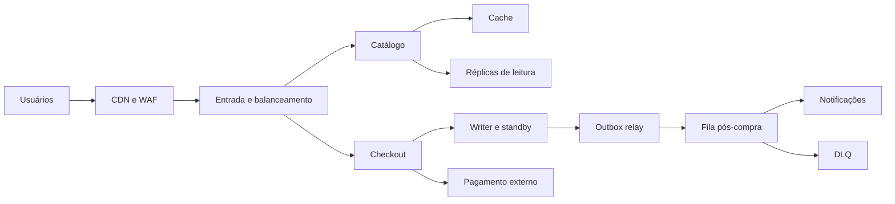

# Visão e decisões arquiteturais

## Três jornadas

DNS, identidade, observabilidade, CI/CD e DR aparecem no backup completo como relações de controle/operação. O diagrama acima resume jornadas de dados e não representa todas as chamadas ou o roteamento do simulador.

## ADR 01 · Leitura eventual e compra autoritativa

**Contexto:** predominância de consulta com menos escritas, porém maior impacto em uma compra inválida.  
**Decisão:** CDN/cache-aside/réplicas para catálogo; writer e reserva condicional para compra.  
**Consequência:** monitorar cache HIT e replication lag; definir TTL/invalidação; testar concorrência. Reserva pela réplica/cache foi descartada por atraso possível.

## ADR 02 · Outbox e entrega com repetição

**Contexto:** banco e broker não compartilham uma transação SQL local.  
**Decisão:** pedido/intenção de evento são gravados juntos; relay publica após commit com confirmação; consumidor controla duplicatas; DLQ encerra tentativas.  
**Consequência:** estado operacional adicional, idade da outbox/fila e processo de reprocessamento. `purchase_confirmed` exige pagamento reconciliado.

## ADR 03 · Writer único e recuperação

**Contexto:** evitar conflitos de escrita fora do escopo da aula.  
**Decisão:** writer + standby; região secundária para DR. RPO ≤ 5 min/RTO ≤ 30 min propostos.  
**Consequência:** restore e failover ensaiados, fencing e possível indisponibilidade durante recuperação. Active-active exigiria estratégia de conflito adicional.

## ADR 04 · Mapa lógico separado dos Labs

**Contexto:** o modelo completo inclui planos de controle/telemetria e alternativas de tráfego.  
**Decisão:** usar Labs lineares para comparar capacidade e manter os mesmos parâmetros.  
**Consequência:** três projetos de apoio; declarar o limite dos motores e evitar interpretar ramificações como perfil 95/5.

## Controles e métricas

Bancos/cache/broker privados; autorização por pedido; segredos fora do código/log; menor privilégio; timeout/retry finitos. Métricas: p95/p99 medidos, erro, saturação, cache HIT, atraso de réplica, idade da fila/outbox/DLQ e pagamentos pendentes. Canary usa métricas; migrações compatíveis e rollback exigem revisão do estado dos dados.

Referências: [PostgreSQL — isolamento](https://www.postgresql.org/docs/current/transaction-iso.html), [PostgreSQL — standby](https://www.postgresql.org/docs/current/warm-standby.html), [RabbitMQ — confirmações e ACK](https://www.rabbitmq.com/docs/confirms).
