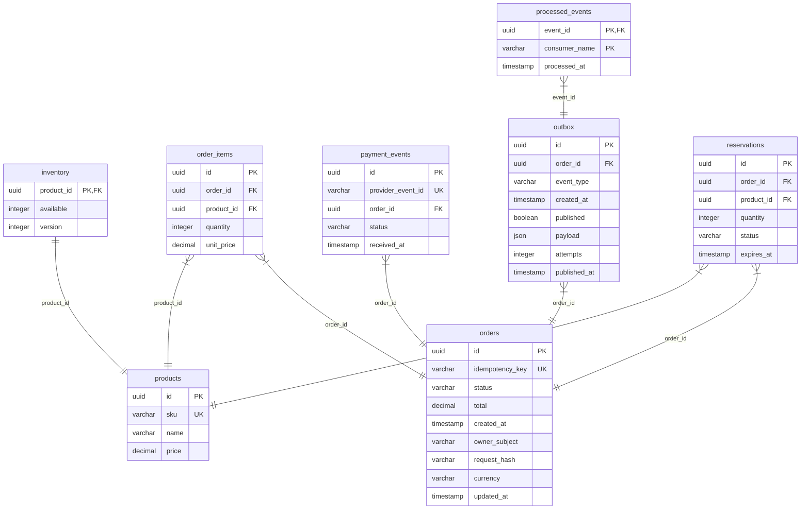

# Modelo de dados — Arquitetura Santa Cecília

**Aprofundamento do exemplo:** estes detalhes de implementação complementam a palestra; não fazem parte da figura original do slide 19. A referência por slide está na [matriz de correspondência](04-correspondencia-palestra.md).

O banco principal contém oito tabelas. `orders` liga dono sintético, chave de idempotência e hash da solicitação; `reservations` explicita expiração e compensação; `outbox` e `processed_events` demonstram entrega e deduplicação.

O SQL está em `../../database/schema.sql`, com CHECKs de estoque/quantidade/estados e unicidade de reserva. Os índices das FKs estão marcados também no Build Arch. A chave de idempotência é globalmente única neste modelo didático; um sistema por cliente pode usar unicidade composta. O domínio deve conferir dono e hash antes de retornar um pedido existente. Metadados de cliente são sintéticos. O modelo não prova concorrência correta nem executa pagamento.
